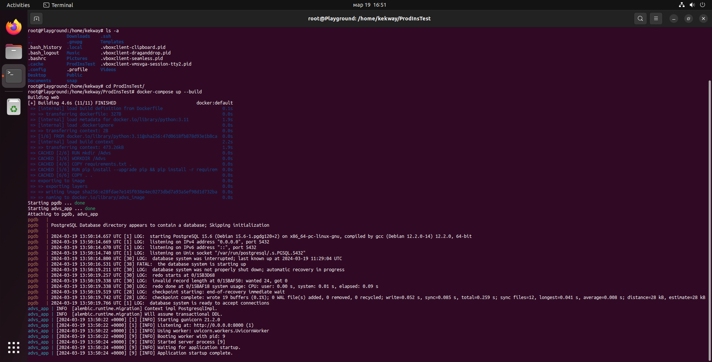
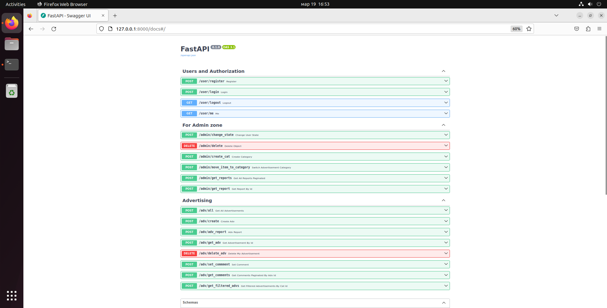

# :bookmark_tabs: Сервис объявлений

## :pager: Стэк
- **Python**
- **FastAPI**
- **Postgresql**
- **SQLAlchemy**

### Тестовое задание для Python Backend Разработчика
## Установка

### 0) Установить константу SU_EMAIL в .env-non-dev (для реализации одной из версий создания  суперпользователя) 
    Константа поддерживает список электронных адресов. Для первичной инициализации супера необходимо заправить лист хотя бы одним значением.
### 1) Запустить контейнеры, находясь в директории проекта.
    docker-compose up --build

### 2) Перейти по адресу
     http://127.0.0.1:8000/docs

## Реализовано:

&#x2705; Регистрация, логин пользователей, просмотр своего профиля.

&#x2705; Создание объявлений, просмотр списка объявлений, просмотр конкретного объявления

&#x2705; Удаление своего объявления.

&#x2705; Создание жалобы на объявление.

&#x2705; Создание комментариев к объявлению.

&#x2705; Для комментариев, объявлений и репортов создана пагинация.

&#x2705; Регистрация, логин суперпользователя. Первичная регистрация происходит из того же эндпоинта, что и регистрация пользователя.
Далее суперпользователь может давать права модератора обычным пользователям. Модератор не может влиять на суперпользователя никаким образом.

&#x2705; Для суперпользователя присутствует возможность удаления объекта в одном эндпоинте. К удалению доступны отдельные записи, пользователи, объявления и комментарии.

&#x2705; Суперпользователь имеет возможность с одного эндпоинта изменить статус любого аккаунта. Доступны команды "ban", "unban", "promote", "demote".

&#x2705; Суперпользователь может перемещать объявления из одной категории в другую.

&#x2705; Суперпользователь может просматривать репорты списком или одиночно.

&#x2705; Доступна фильтрация объявлений по категориям.

:x: Не реализована отправка сообщений в Telegram при критических ошибках.

:x: Отзыв на составленное объявление. По сути, тот же репорт, но другой статус.

:x: Нет адекватного логгера.

